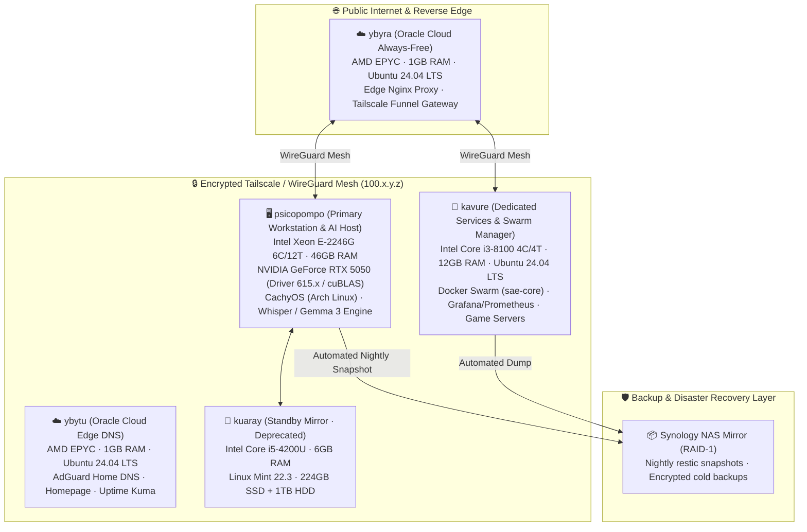

# 📋 Carlos Eduardo Rodrigues — Curriculum Vitae & Portfolio

[](https://github.com/ceduardorodrig/CURRICULUM-VITAE/actions/workflows/ci.yml)
[](LICENSE.md)
[](https://github.com/ceduardorodrig/STENIO-SENTINEL)
[-orange)](#-curriculum-versions)
[](https://github.com/ceduardorodrig)

> **"Using open-source local technology ingeniously to bridge anthropology, data science, and communications."**

---

## 📑 Table of Contents

- 🌍 [About](#-about)
- 📑 [Curriculum Versions](#-curriculum-versions)
- 🚀 [Sumænimá Hub v3.1.0](#-sumænimá-hub-v310)
  - 🏛️ [Bureau Sumænimá](#️-bureau-sumænimá)
  - 🃏 [Arandu TCG Platform](#-arandu-tcg--card-analytics--social-trading-platform)
  - 🌌 [Asciline Engine](#-asciline--real-time-procedural-ascii-engine)
  - ⚡ [Architectural Breakthroughs](#-architectural-breakthroughs-v30--100-rust)
- 🛡️ [StenioSentinel v3.1.0 — Rust AI Governance Engine](#️-steniosentinel-v310--rust-ai-governance-engine)
- 🖥️ [Mnemocine Homelab Infrastructure (5 Nodes)](#️-mnemocine-homelab-infrastructure-5-nodes)
- 📦 [Featured Open-Source Projects](#-featured-open-source-projects)
- 📊 [By the Numbers](#-by-the-numbers)
- 🧵 [The Thread (Narrative)](#-the-thread-narrative)
- 📸 [Fieldwork & Photographic Archive](#-fieldwork--photographic-archive)
- 📚 [Publications & Media](#-publications--media)
- 📜 [License](#-license)
- 📬 [Contact](#-contact)

---

## 🌍 About

I am a **hybrid product architect, data engineer, and anthropologist** based in Brasília, Brazil. 

Throughout my decade-long trajectory, I have designed and deployed high-performance technological systems that turn complex, unstructured field realities — traditional community territorial claims, high-level governmental deliberative meetings, and qualitative ethnographies — into actionable, verifiable, and secure digital assets.

This repository hosts my comprehensive curriculum vitae organized across **6 dedicated profiles**, fully synchronized and version-controlled in both **English (US)** and **Brazilian Portuguese (PT-BR)**. 

The accompanying ecosystem reflects a 10-year life endeavor encompassing **~8M+ lines of source code, structured documentation, and multimodal assets** governed by deterministic, verifiable rules.

---

## 📑 Curriculum Versions

Choose the profile that matches your focus:

### 🇺🇸 English (US)

| # | Profile | Target Audience & Focus | Document Link |
|:---:|:---|:---|:---:|
| **01** | **🖥️ Tech / Product / Data** | Technology companies, AI/data startups, senior product engineering roles | [`en-us/01-tech-product-data-en.md`](en-us/01-tech-product-data-en.md) |
| **01b** | **📊 Tech / Business Data** | Enterprises, consultancies, process diagnostics, data analytics & automation | [`en-us/01-tech-business-data-en.md`](en-us/01-tech-business-data-en.md) |
| **01c** | **🎯 Product Manager** | Digital product management, agile delivery, tech-for-good, platform strategy | [`en-us/01-tech-pm-en.md`](en-us/01-tech-pm-en.md) |
| **02** | **🌳 Socioenvironmental-Tech** | Research institutes, international foundations, NGOs, climate impact initiatives | [`en-us/02-socioenvironmental-tech-en.md`](en-us/02-socioenvironmental-tech-en.md) |
| **02b** | **🏛️ Socioenvironmental (Institutional)** | Public agencies, multilateral governance, land demarcation, traditional communities policy | [`en-us/02-socioenvironmental-niche-en.md`](en-us/02-socioenvironmental-niche-en.md) |
| **03** | **🚀 Sumænimá (Venture & Vision)** | Accelerators, innovation funds, academic partnerships, institutional grants | [`en-us/03-sumaenima-en.md`](en-us/03-sumaenima-en.md) |

### 🇧🇷 Português (PT-BR)

| # | Versão | Público & Foco | Arquivo |
|:---:|:---|:---|:---:|
| **01** | **🖥️ Tech / Produto / Dados** | Startups de tecnologia, empresas de produto, vagas em engenharia de dados e IA | [`pt-br/01-tech-produto-dados-br.md`](pt-br/01-tech-produto-dados-br.md) |
| **01b** | **📊 Tech / Dados & Negócios** | Empresas, diagnóstico de processos, consultoria em dados e inteligência de negócios | [`pt-br/01-tech-dados-negocios-br.md`](pt-br/01-tech-dados-negocios-br.md) |
| **01c** | **🎯 Product Manager** | Gestão de produtos digitais, liderança ágil, impacto socioambiental e estratégia | [`pt-br/01-tech-pm-br.md`](pt-br/01-tech-pm-br.md) |
| **02** | **🌳 Socioambiental-Tech** | Institutos de pesquisa, organismos multilaterais, fundações, projetos de impacto socioambiental | [`pt-br/02-socioambiental-tech-br.md`](pt-br/02-socioambiental-tech-br.md) |
| **02b** | **🏛️ Socioambiental (Institucional)** | Órgãos públicos, regularização fundiária, políticas para Povos e Comunidades Tradicionais (PCTs) | [`pt-br/02-socioambiental-nichado-br.md`](pt-br/02-socioambiental-nichado-br.md) |
| **03** | **🚀 Sumænimá (Negócios & Visão)** | Aceleradoras, investidores de impacto, editais de fomento e parcerias institucionais | [`pt-br/03-sumaenima-br.md`](pt-br/03-sumaenima-br.md) |

---

## 🚀 Sumænimá Hub v3.1.0

**Private, Local-First Intelligence & Ethnographic Data Capture Platform**  
*Unified Monorepo · 100% Rust Native Backend (`stenio-server` Axum 0.8 / Tokio / SQLx) · React 19 / TypeScript 6 · In-Browser Rust WebAssembly DSP · Dual-Stage Neural Pipeline*

<p align="center">
  
  
  
</p>

> *"Contemporary information architecture requires deep listening and deterministic pipelines. We fuse anthropological ethnography with systems engineering to build fluid, sovereign, and privacy-preserving documentation platforms."*
>
> — Carlos Eduardo Rodrigues, Sumænimá Architectural Manifesto

Sumænimá Hub is an enterprise-grade, local-first platform built to eliminate dependency on foreign corporate clouds for sensitive socio-environmental, governmental, and analytical data.

### 🏛️ Bureau Sumænimá

#### 🎙️ StênioREC — Real-Time Transcription & Reporting Cockpit
**Status:** 🟢 **Production** — Deployed and verified in high-stakes governmental and territorial assemblies.

<p align="center">
  
</p>

- **Client-Side DSP via Rust WebAssembly:** Captures high-fidelity 16kHz audio using the browser's `AudioWorklet` API. Audio buffers are normalized, pre-filtered, and analyzed in real time with acoustic RMS (VAD) inside compiled Rust WebAssembly before streaming.
- **Dual-Stage Neural Flow:**
  1. *Sub-500ms Draft Stage:* Fast speech recognition powered by whisper.cpp with native CUDA 13 acceleration on NVIDIA GeForce RTX 5050 (Blackwell sm_120).
  2. *Parallel Semantic Purification:* Contextual cleansing, speaker disambiguation, and parliamentary-grade punctuation using Gemma 3 IT.
- **Anti-Loop Shield & Local Agreement:** Real-time heuristic agreement engine prevents hallucination loops and audio packet drift during long deliberative sessions.
- **Fail-Safe Offline Resilience:** Two-tier local buffer (57 MB RAM + 171 MB IndexedDB) ensures up to 2 hours of continuous recording during complete network blackouts without a single frame dropped.
- **Zero-Cloud Data Sovereignty:** 100% of audio and inference operates within local homelab hardware (`psicopompo`), with selective OAuth export to Google Docs for cooperative live editing.

##### 📋 Field Validation & Battle Testing:
- 🏛️ **Presidency of Brazil / Palácio do Planalto (CNPCT):** Live documentation and legal reporting for the National Council of Traditional Peoples and Communities across multiple ordinary sessions, including the historic 22nd Assembly presenting the Land Regularization Decree with Minister **Marina Silva**.
- 📊 **IPEA (Institute for Applied Economic Research):** Official reporting for Movements 5 (Integration) and 7 (Information Management) during the institute's Multi-Year Strategic Planning summit.
- 🏫 **FLONA de Tefé (Amazon):** Intensive ethnographic reporting for 39 community leaders in the *"Formar Protagonistas"* program (IEB / APAFE / Rainforest Trust).
- 🌱 **Sociobiodiversity National Summit:** Youth leadership assemblies with IEB, CNS, MCM, and CONFREM.
- 🌰 **OCA — Brazil Nut Observatory:** Live reporting across extractive communities in the Amazon basin.

#### 📚 Biblioteca — Institutional Knowledge CMS
**Status:** 🟢 **Production** — Sovereign content management and institutional publishing.
- Dynamic Markdown CMS powered by TipTap, dynamic tagging, document drafting workflows, and instant publishing.
- Direct integration with PostgreSQL 16 via SQLx and local disk mirrors for zero-cloud resilience.

---

### 🃏 Arandu TCG — Card Analytics & Social Trading Platform

**Status:** 🟢 **Production** — Ultra-fast heuristics, inventory management, and P2P matching.
- **Atomic In-Memory Heuristics (<1ms):** Native Rust computational engine (`arandu-engine`) computing mana curves, color distributions, converted mana cost (CMC), and real-time USD/BRL currency conversions.
- **Interactive 3x3 Virtual Binder & Wishlist:** Drag-and-drop tactile portfolio management replicating physical trade binders in high-refresh React 19.
- **Algorithmic Trade Radar:** P2P card matching algorithms cross-referencing collections and wishlists with PostgreSQL 16 + pgvector.

---

### 🌌 Asciline — Real-Time Procedural ASCII Engine

**Status:** 🟢 **Production** — Ultra-low-overhead visual streaming.
- Real-time procedural ASCII streamer transmitting animations, mathematical fractals, and cosmic visualizations over Axum WebSockets with zero CPU overhead.

---

### ⚡ Architectural Breakthroughs (v3.0 / 100% Rust)

```
                     ┌─────────────────────────────────────────────────────────┐
                     │            stenio-server (Native Rust Binary)           │
                     │   Axum 0.8 · Tokio Work-Stealing · SQLx · whisper.cpp   │
                     └────────────────────────────┬────────────────────────────┘
                                                  │
                 ┌────────────────────────────────┼────────────────────────────────┐
                 ▼                                ▼                                ▼
   ┌───────────────────────────┐    ┌───────────────────────────┐    ┌───────────────────────────┐
   │    HTTP REST & Frontend   │    │  WebSocket Audio Daemon   │    │     Arandu Engine TCG     │
   │  SPA React 19 + MD3 PWA   │    │  Whisper CUDA 13 (sm_120) │    │  In-Memory Heuristics     │
   │  Catalogs / Auth / CMS    │    │  Local Agreement & Purify │    │   Curves, CMC & Binders   │
   └───────────────────────────┘    └───────────────────────────┘    └───────────────────────────┘
```

- **Zero Dynamic Runtimes:** Total elimination of legacy Python, FastAPI, uvicorn, PyTorch, and Celery/arq workers.
- **Drastic RAM Reduction:** Idle memory dropped from ~2.5 GB to **~25 to 35 MB**.
- **Ultralight Container:** Production Docker CUDA image shrank from ~20 GB to **~500 MB**.
- **Instant Cold Start:** Startup time accelerated from ~20 seconds to **< 100 milliseconds**.
- **True Multi-Thread Concurrency:** Tokio work-stealing scheduler leveraging all physical cores without Python GIL contention.

---

## 🛡️ StenioSentinel v3.1.0 — Rust AI Governance Engine

Developed to address the critical risks of autonomous coding agents (sycophancy, hallucinated tests, silent regressions, and dependency bloat), **StenioSentinel** is our open-source static analysis and architectural governance sentinel written in pure **Rust 2024**.

- **Sub-Millisecond Auditing (<1ms to <500ms):** Validates whole workspaces and monorepos instantaneously using Rayon multi-threading.
- **Mandatory Quality Gate (Rule 0):** Zero tolerance for blind commits or suppressed checks (`// @ts-ignore`, `// stenio-ignore`, `.unwrap()` in production Rust).
- **Sectorized Scopes:**
  - `stenio --scope hub`: Enforces backend architecture, frontend reactivity, and ADR standards.
  - `stenio --scope homelab`: Audits network mounts, systemd units, Tailscale topologies, and documentation integrity.
  - `stenio --scope vault`: Enforces Obsidian YAML metadata, official tag taxonomies (`_tags.md`), and markdown link validity.
  - `stenio --scope all`: Comprehensive system-wide multi-subsystem audit.
- **Automated Remediation (`--fix`):** Safely resolves formatting, taxonomy anomalies, and structural divergences automatically.

---

## 🖥️ Mnemocine Homelab Infrastructure (5 Nodes)

Our infrastructure embodies the principle that cutting-edge AI and data engineering do not require massive corporate cloud expenditures. The **Mnemocine Homelab** operates as a resilient, encrypted 5-node hybrid topology across local hardware and edge cloud compute:



- **Zero Secrets in Code:** Cryptographic SOPS / Age keyrings protecting environment configurations.
- **Resilient Storage & Snapshots:** Btrfs copy-on-write subvolumes, Snapper triggers, and automated nightly offsite Restic backups to NAS storage.

---

## 📦 Featured Open-Source Projects

- **[`STENIO-SENTINEL`](https://github.com/ceduardorodrig/STENIO-SENTINEL)** (Rust 2024)  
  Sub-millisecond static governance engine, anti-bypass quality gate, and architectural integrity sentinel for AI coding agents.
- **[`WITH-SMOOTH-MOTION`](https://github.com/ceduardorodrig/WITH-SMOOTH-MOTION)** (Rust 2024)  
  Dynamic adaptive tearing governor and direct scanout manager for high-refresh-rate Wayland compositors (Hyprland / Valve games).
- **[`MNEMOCINE`](https://github.com/ceduardorodrig/MNEMOCINE)** (Homelab Architecture & Manifests)  
  5-node sovereign hybrid cloud, bare-metal AI infrastructure, and self-hosted service manifests.
- **[`CURRICULUM-VITAE`](https://github.com/ceduardorodrig/CURRICULUM-VITAE)** (Markdown / Automation)  
  Bilingual executive portfolio and self-auditing curriculum across 6 dedicated profiles.

---

## 📊 By the Numbers

| Metric | Measurement | Context |
|:---|:---:|:---|
| **Curated Code & Assets** | **~8M+ lines** | Rust, TypeScript, Python, Shell, Markdown, and high-res datasets |
| **Monorepo Files** | **1,227+** | Tightly coupled, version-governed files across 5 server nodes |
| **Trajectory** | **10 years** | Integrating anthropology, technology, and public policy |
| **Active Platform Engineering** | **~2.5 years** | Continuous production development of Sumænimá Hub |
| **Audience Reached** | **2+ Million** | Led digital campaigns and documentary productions at IPAM |
| **Traditional Territories Mapped** | **+2,500 communities** | Co-architect and field ethnographer for the *Tô no Mapa* platform |
| **Inference Latency** | **<500ms** | Real-time local Whisper transcription response on RTX hardware |

---

## 🧵 The Thread (Narrative)

My career looks non-linear only until you recognize the recurring pattern: **Throughout my journey, I have used technology to bridge worlds that rarely speak to one another.**

I began in 2017 as an intern and field researcher at the **ISPN** (Society, Population, and Nature Institute). Deep in the Brazilian Cerrado, conducting ethnographic fieldwork with traditional riverside and quilombola populations, I confronted a staggering reality: official government maps accounted for only **28% of traditional territories**. The remaining 72% simply did not exist in the eyes of the state — rendering these communities invisible to basic sanitation, healthcare, and territorial defense.

What I learned in the dust and water — that data is not merely numbers, but living memory, territory, and struggle — led me to co-architect the [**Tô no Mapa Platform**](https://tonomapa.org.br/). By placing intuitive spatial mapping tools directly into the hands of indigenous and traditional youth, we helped register over 2,500 communities, creating an official database now integrated directly into the Federal Public Prosecutor's Office (MPF).

At **IPAM** (Amazon Environmental Research Institute, 2022–2025), I evolved from communications analyst to digital strategist. I spearheaded institutional growth that delivered **+143% digital engagement**, reached over **2 million people**, served as Scrum Master for cross-functional teams, co-directed a science documentary on Amazonian climate extremes, and received a Mercosur Science Journalism Award. Yet, this intense period also brought clarity: managing conventional institutional public relations was not my calling. Burnout arrived hand-in-hand with conviction.

In 2024, I channeled every lesson learned into building **Sumænimá** — the independent technological venture I had conceived years earlier. My core thesis was clear: **Sensitive community and institutional data must never depend on foreign corporate AI clouds.**

Since 2025, that vision has been tested at the highest echelons of public deliberation. As the official rapporteur for the **National Council of Traditional Peoples and Communities (CNPCT)**, my platform **StênioREC** operated inside the **Palácio do Planalto**, capturing, indexing, and purifying the historic proceedings that culminated in the Land Regularization Decree, inaugurated by Environment Minister **Marina Silva**.

To sustain this work independently, I constructed the **Mnemocine Homelab**: five networked nodes running open-source systems, orchestrated through Tailscale and Docker, proving that sovereign local artificial intelligence is both feasible and superior.

Today, I stand as a **hybrid**: a product and data architect who thinks like an ethnographer. I translate ambiguous human needs into resilient distributed software, and complex systems architecture into lasting socio-environmental impact.

---

## 📸 Fieldwork & Photographic Archive

A visual testimony to the fieldwork and institutional assemblies shaping this platform:

| | |
|:---:|:---:|
|  |  |
| **2017** · Quilombola, fishing, and vazanteira community of Caraíbas [Pedras de Maria da Cruz \| MG] | **2017** · Technical mission for ISPN / PPP-ECOS community projects [Rosário \| MA] |
|  |  |
| **2018** · Free Land Camp (Acampamento Terra Livre - ATL) [Brasília \| DF] | **2019** · *Tô no Mapa* mapping workshop at Federal University of Tocantins [Arraias \| TO] |
|  |  |
| **2019** · Gathering of Cerrado Peoples — *Tô no Mapa* Launch [Brasília \| DF] | **2021** · Expedition gate at Fazenda Canadá, Chapada dos Veadeiros National Park [Cavalcante \| GO] |
|  |  |
| **2024** · Scientific expedition at Tanguro Research Station with IPAM & Woodwell [Querência \| MT] | **2024** · Rainfall exclusion experiment analyzing Amazon forest resilience [Querência \| MT] |
|  |  |
| **2025** · Public Forests Policy Workshop with IPAM [Santarém \| PA] | **2025** · FLONA de Tefé leadership delegation inside the National Congress [Brasília \| DF] |
|  |  |
| **2025** · Trainees of the *"Formar Protagonistas"* cohort from Central Amazonia [Brasília \| DF] | **2026** · National Council of Traditional Peoples meeting with the Chief of Staff, Palácio do Planalto [Brasília \| DF] |

---

## 📚 Publications & Media

- **Academic Journal Article (Co-author):**  
  Moser, P.; de Castro Silva, I.; Benedetti Figueiredo, I.; Favilla, K.; Bustamante, M.; Macedo, M.N.; de Araújo, R.F.; Shimbo, J.Z.; Varela, V.; **Rodrigues, C.E.**; Alencar, A.A.  
  *"Institutional Invisibility Threatens the Lands and Livelihoods of Traditional Communities in the Northern Brazilian Cerrado"* — Submitted to **Land Use Policy** (Elsevier, 2026).
  > Fieldwork conducted during ethnographic studies at the University of Brasília (UnB) and technical advisorship at ISPN, documenting unmapped territories across the Cerrado biome.

- **Analytical Essay:**  
  Rodrigues, C.E. *"Doenças são sintomas de uma crise cultural e ambiental"* (*Diseases are Symptoms of a Cultural and Environmental Crisis*) — **JOTA**, Em Clima de Justiça (2026). [Read Online](https://www.jota.info/opiniao-e-analise/colunas/em-clima-de-justica/doencas-sao-sintomas-de-uma-crise-cultural-e-ambiental).

- **Documentary Feature:**  
  *RUA PARA QUE(M)?* (85 min, 2020) — Direction, cinematography, and editing. Premiered by Sumænimá.

- **Documentary Short:**  
  *Manaus Extrema* (2024) — Co-direction and narrative editing. Produced by IPAM.

---

## 📜 License

- **Software, Scripts & Tooling:** [MIT License](LICENSE.md)
- **Content, Written Profiles & Documentation:** [Creative Commons Attribution 4.0 International (CC-BY-4.0)](https://creativecommons.org/licenses/by/4.0/)

---

## 📬 Contact

- 📧 **Email:** [ceduardorodrig@gmail.com](mailto:ceduardorodrig@gmail.com)
- 📱 **Phone / WhatsApp:** +55 (61) 9-9803-3546
- 💼 **LinkedIn:** [linkedin.com/in/c-eduardo-rodrigues](https://linkedin.com/in/c-eduardo-rodrigues)
- 🐙 **GitHub:** [github.com/ceduardorodrig](https://github.com/ceduardorodrig)
- 🌐 **Sumænimá:** [sumaenima.chimaera-heptatonic.ts.net](https://sumaenima.chimaera-heptatonic.ts.net)
- 📍 **Location:** Brasília, DF, Brazil (UTC-03:00)

---

<div align="center">

> **Yes... This is a Vibe Coded project**
>
> Governed by 🤖 **StenioSentinel** (our Rust-based AI Governance Sentinel) with **Carlos Eduardo Rodrigues** ([@ceduardorodrig](https://github.com/ceduardorodrig)).

</div>
